# Data Flow Architecture

## Overview

This document describes the data flow patterns within the Brainlyx AI platform, detailing how information moves between components, external services, and storage systems.

## Primary Data Flows

### 1. User Authentication Flow

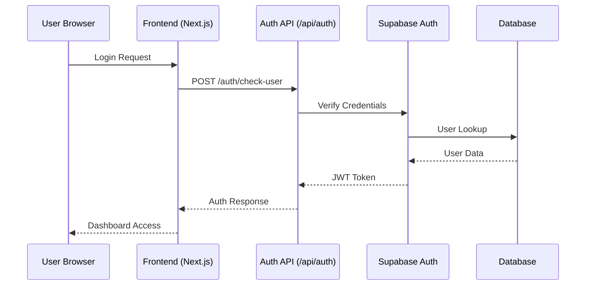

**Data Elements:**
- User credentials (email/password)
- JWT tokens with user claims
- User profile information
- Session metadata

### 2. Chat Message Flow

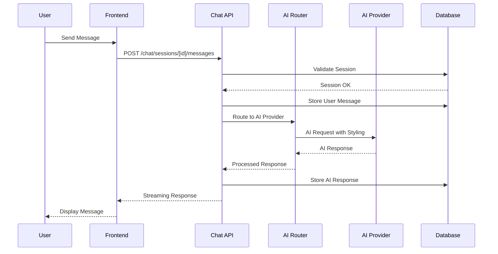

**Data Elements:**
- Message content and metadata
- Chat session identifiers
- AI provider responses
- Streaming data chunks
- Conversation history

### 3. AI Provider Selection Flow

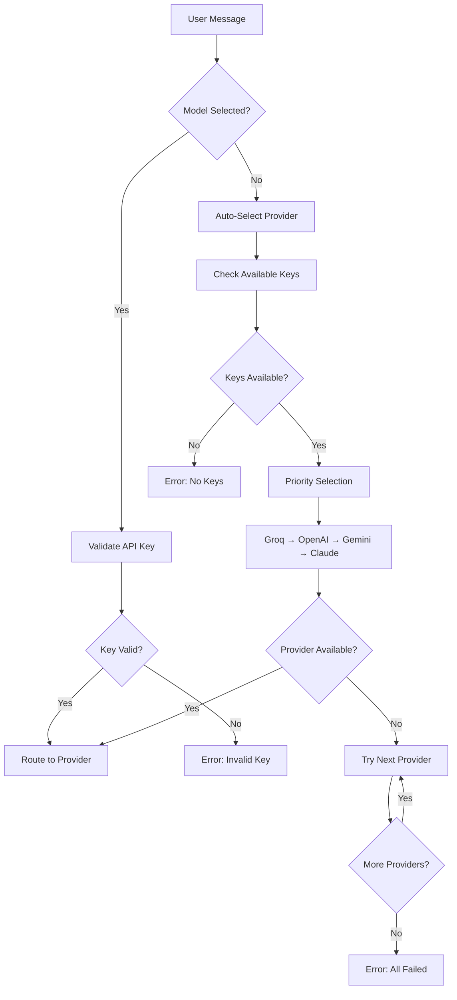

**Data Elements:**
- API key validation results
- Provider availability status
- Selection criteria (performance, cost, capabilities)
- Fallback attempt logs

## File Processing Flow

### Document Upload and Analysis

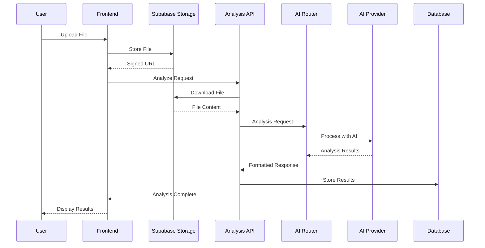

**Data Elements:**
- File metadata (name, type, size)
- Signed URLs for secure access
- Binary file content
- Analysis results and insights
- Processing status updates

## Database Data Flow Patterns

### Core Entity Relationships

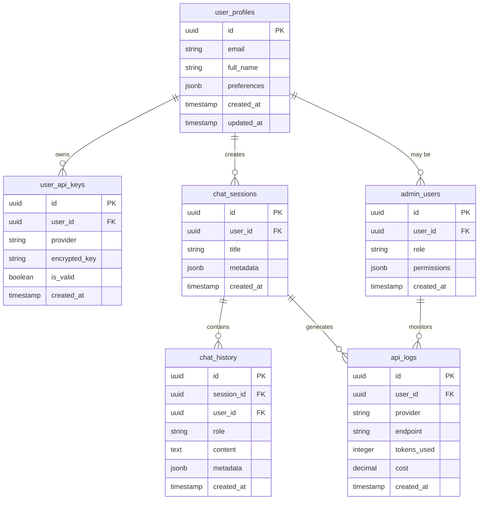

### Data Access Patterns

#### Read-Heavy Patterns
- **Chat History Retrieval**: Session-based message queries with pagination
- **User Profile Loading**: Authenticated user data for dashboard
- **API Key Validation**: Provider-specific key checks
- **Analytics Queries**: Usage statistics and performance metrics

#### Write Patterns
- **Message Storage**: High-frequency chat message inserts
- **Session Creation**: New conversation initialization
- **Audit Logging**: Security event and usage tracking
- **User Registration**: Profile and preference setup

#### Real-time Patterns
- **Live Chat Updates**: WebSocket-based message streaming
- **Status Monitoring**: User online/offline indicators
- **Admin Notifications**: System alerts and user activity

## External API Integration Flows

### AI Provider Communication

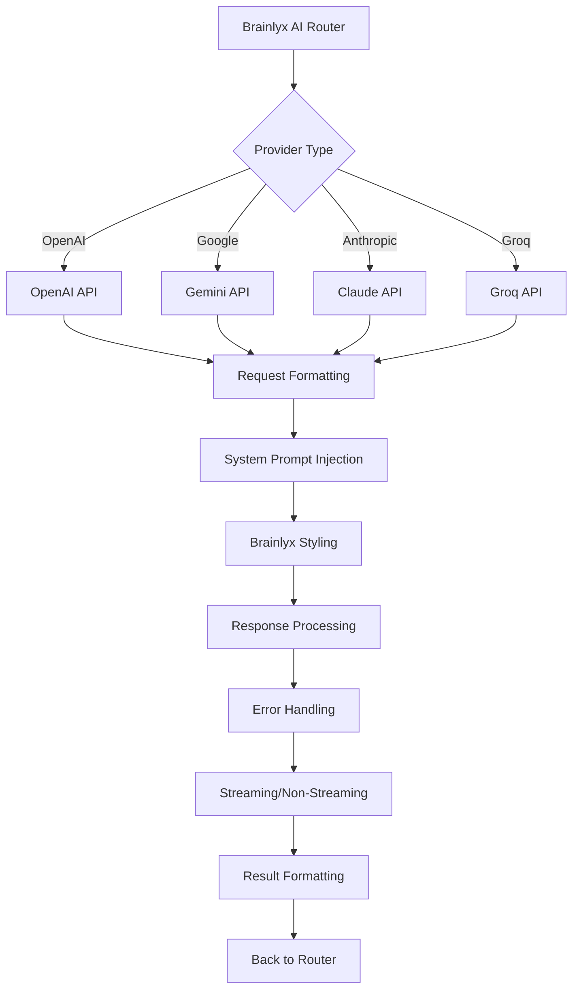

**Communication Protocols:**
- **RESTful APIs**: Standard HTTP/HTTPS with JSON payloads
- **Streaming Support**: Server-Sent Events for real-time responses
- **Error Handling**: Provider-specific error code mapping
- **Rate Limiting**: Request throttling and retry logic

### Supabase Integration

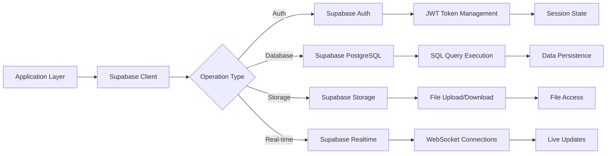

## Security Data Flow

### Authentication Data Protection

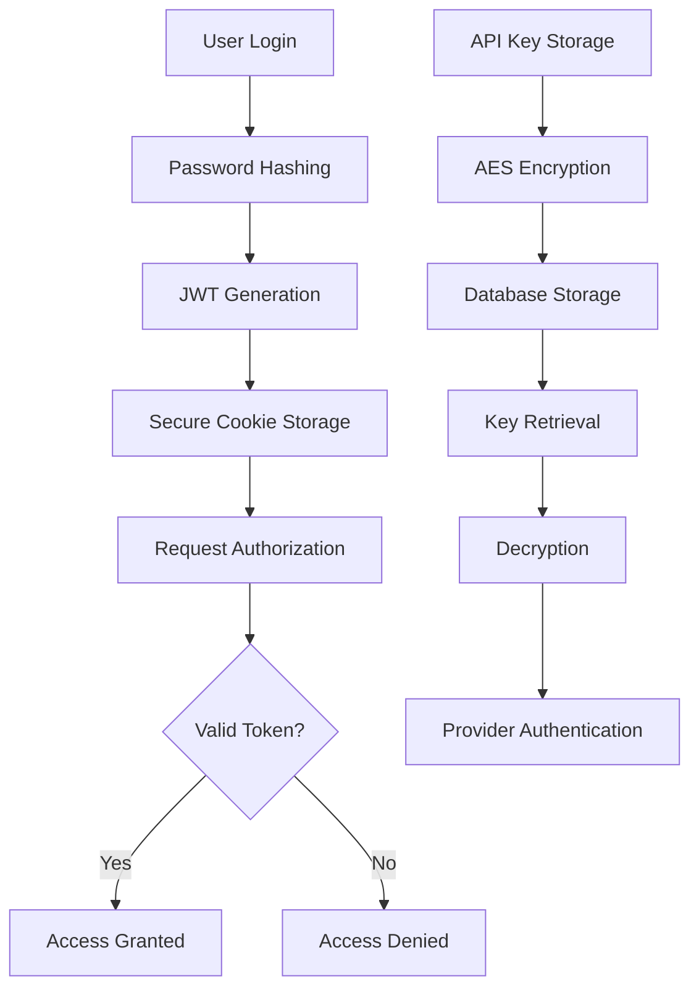

### Audit and Compliance

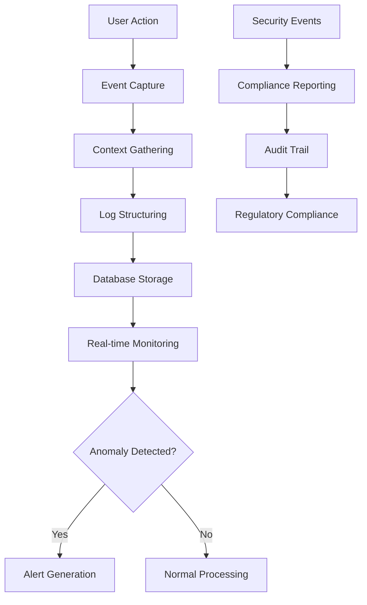

## Performance Data Flow

### Caching Strategy

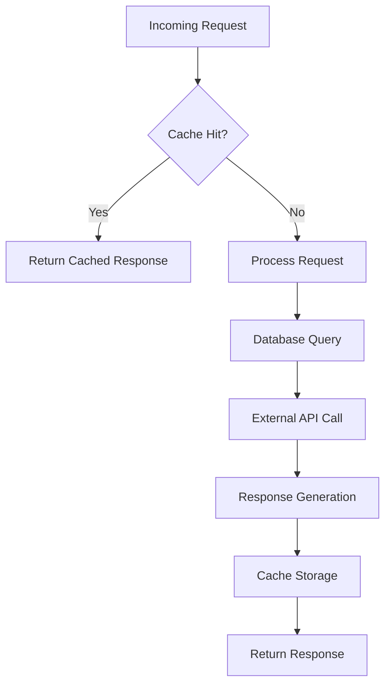

### Monitoring Data Collection

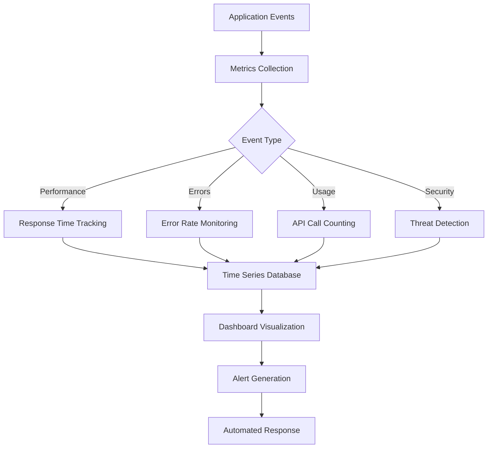

## Error Handling and Recovery

### Error Propagation Flow

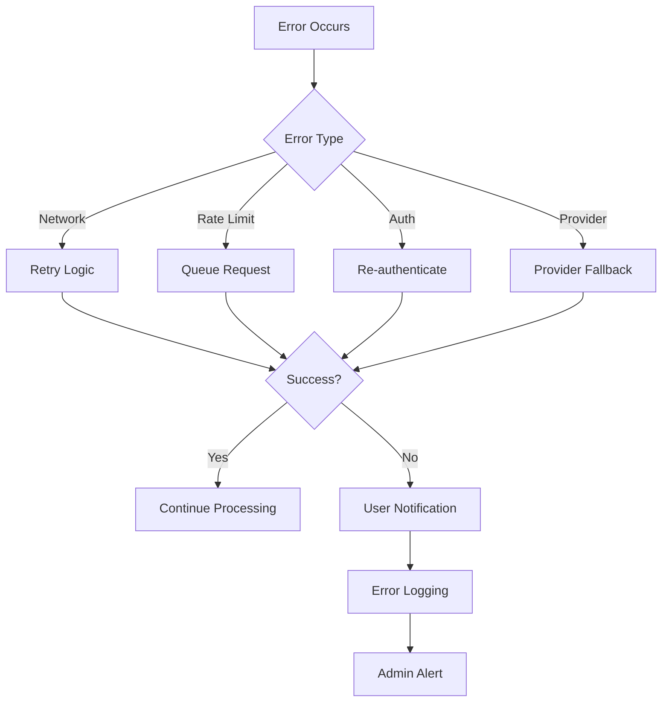

### Data Consistency Patterns

- **Transactional Boundaries**: Database operations within atomic transactions
- **Eventual Consistency**: Real-time updates with conflict resolution
- **Idempotent Operations**: Safe request retries without side effects
- **Graceful Degradation**: System continues operating with reduced functionality