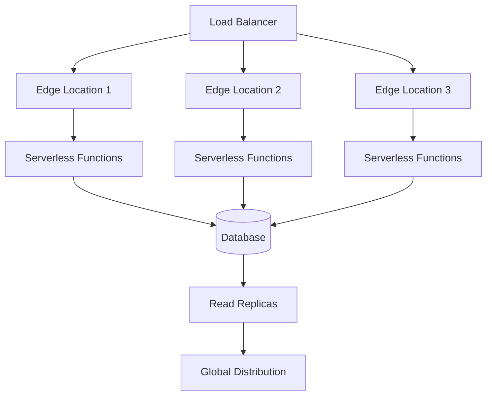
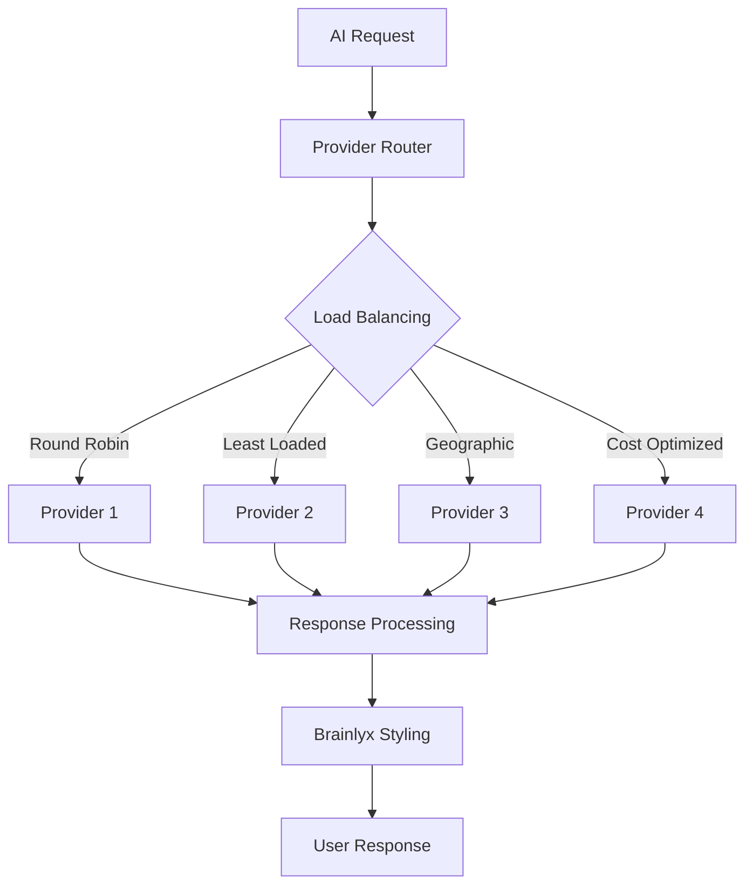
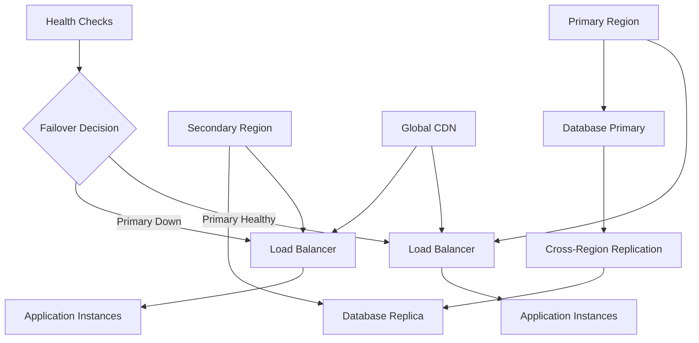

# Scaling Strategy

## Overview

Brainlyx AI is designed with scalability as a core architectural principle. This document outlines the strategies and mechanisms for handling increased load, ensuring high availability, and maintaining performance as the platform grows.

## Architecture Principles for Scalability

### 1. Serverless-First Design
- **Function as a Service (FaaS)**: Next.js API routes run as serverless functions
- **Auto-scaling**: Automatic scaling based on request volume
- **Pay-per-execution**: Cost optimization through usage-based pricing
- **Global Distribution**: Edge network deployment for reduced latency

### 2. Stateless Architecture
- **No Server State**: All state managed in external services
- **Database Sessions**: Stateless authentication with JWT tokens
- **External Storage**: File and session data in Supabase
- **Horizontal Scaling**: Instances can be added/removed without data loss

### 3. Microservice Boundaries
- **Loose Coupling**: Components communicate through well-defined APIs
- **Independent Scaling**: Each service scales based on its load
- **Fault Isolation**: Component failures don't cascade
- **Technology Diversity**: Optimal tools for each function

## Scaling Dimensions

### 1. Vertical Scaling (Scale Up)

#### Database Scaling
```yaml
Current: Supabase PostgreSQL
Scaling Strategy:
  - Connection Pooling: PgBouncer for connection management
  - Read Replicas: Distribute read queries across multiple instances
  - Indexing: Optimized queries with composite indexes
  - Caching: Redis integration for frequently accessed data
  - Partitioning: Time-based partitioning for chat_history table
```

#### Memory and CPU Optimization
```yaml
Application Layer:
  - Memory: Optimize React component re-rendering
  - CPU: Efficient AI response processing
  - Caching: Response caching for repeated queries
  - Compression: Gzip compression for all responses
```

### 2. Horizontal Scaling (Scale Out)

#### Load Distribution


#### Geographic Distribution
- **CDN Integration**: Static assets served from global edge locations
- **Regional Databases**: Data replication across geographic regions
- **Latency-Based Routing**: Direct users to nearest data center
- **Failover Regions**: Automatic failover to backup regions

## Component-Level Scaling Strategies

### Frontend Scaling

#### Static Asset Optimization
```typescript
Strategies:
  - Code Splitting: Dynamic imports for route-based loading
  - Image Optimization: Next.js Image component with WebP support
  - Bundle Analysis: Webpack bundle analyzer for size optimization
  - CDN Delivery: Global CDN for static assets
  - Service Worker: Offline capability and caching
```

#### Client-Side Performance
```typescript
Optimizations:
  - Virtual Scrolling: For large chat histories
  - Debounced Inputs: Reduce API calls during typing
  - Lazy Loading: Components loaded on demand
  - Memory Management: Proper cleanup of event listeners
  - Progressive Enhancement: Core functionality works without JavaScript
```

### Backend API Scaling

#### Request Processing
```typescript
Scaling Mechanisms:
  - Concurrent Processing: Handle multiple requests simultaneously
  - Queue Management: Background job processing for heavy tasks
  - Streaming Responses: Real-time data without blocking
  - Connection Pooling: Efficient database connection reuse
  - Rate Limiting: Prevent abuse while maintaining fairness
```

#### API Gateway Features
```yaml
Rate Limiting:
  - Per-User Limits: Based on subscription tier
  - Per-IP Limits: Prevent abuse from single sources
  - Burst Handling: Allow temporary spikes
  - Graduated Limits: Increase limits for good users

Load Balancing:
  - Round Robin: Equal distribution
  - Least Connections: Direct to least loaded server
  - Geographic: Route to nearest region
  - Health Checks: Remove unhealthy instances
```

### AI Provider Scaling

#### Multi-Provider Load Distribution


#### Provider-Specific Scaling
```yaml
OpenAI:
  - Rate Limits: 10,000+ RPM depending on tier
  - Token Limits: Model-specific concurrent requests
  - Cost Optimization: GPT-3.5 for simple queries

Google Gemini:
  - Regional Endpoints: Global distribution
  - Quota Management: Per-project limits
  - Multi-modal Scaling: Image processing optimization

Anthropic Claude:
  - Token-based Limits: Concurrent request management
  - Regional Availability: US/EU endpoint selection
  - Cost Efficiency: Appropriate model selection

Groq:
  - Ultra-low Latency: <1 second responses
  - High Throughput: Massive concurrent processing
  - Cost Effective: For high-volume simple tasks
```

### Database Scaling

#### Read/Write Optimization
```sql
Scaling Patterns:
  -- Read Replicas for Analytics
  SELECT * FROM chat_history WHERE user_id = $1 ORDER BY created_at DESC LIMIT 50;

  -- Write Optimization with Indexing
  CREATE INDEX CONCURRENTLY idx_chat_history_user_session
  ON chat_history(user_id, session_id, created_at DESC);

  -- Partitioning Strategy
  CREATE TABLE chat_history_y2024m01 PARTITION OF chat_history
  FOR VALUES FROM ('2024-01-01') TO ('2024-02-01');
```

#### Connection Management
```yaml
Connection Pooling:
  - Max Connections: 100 per instance
  - Connection Timeout: 30 seconds
  - Idle Timeout: 10 minutes
  - Prepared Statements: Query optimization

Monitoring:
  - Connection Count: Track active connections
  - Query Performance: Slow query logging
  - Lock Contention: Deadlock detection
  - Storage Growth: Table size monitoring
```

## Performance Optimization Strategies

### Caching Strategy

#### Multi-Level Caching
```typescript
Caching Layers:
  1. Browser Cache: Static assets and API responses
  2. CDN Cache: Global edge caching
  3. Application Cache: In-memory response caching
  4. Database Cache: Query result caching
  5. AI Response Cache: Similar query responses
```

#### Cache Invalidation
```typescript
Strategies:
  - Time-based: TTL for volatile data
  - Event-based: Invalidate on data changes
  - Manual: Admin-triggered cache clearing
  - Smart: LRU eviction for optimal memory usage
```

### Monitoring and Alerting

#### Key Metrics to Monitor
```yaml
Application Metrics:
  - Response Time: P50, P95, P99 percentiles
  - Error Rate: 4xx and 5xx error percentages
  - Throughput: Requests per second
  - Resource Usage: CPU, memory, disk utilization

Business Metrics:
  - Active Users: Daily and monthly active users
  - API Usage: Calls per user, tokens consumed
  - Provider Costs: Spend per provider and user
  - User Retention: Session duration and return rates

Infrastructure Metrics:
  - Database Performance: Query latency and throughput
  - AI Provider Latency: Response times by provider
  - Cache Hit Rate: Effectiveness of caching strategy
  - Error Patterns: Common failure modes
```

#### Alerting Strategy
```yaml
Alert Levels:
  - Warning: Performance degradation (P95 > 2s)
  - Critical: Service unavailability (>5% errors)
  - Emergency: Complete system failure

Response Protocols:
  - Auto-scaling: Trigger additional capacity
  - Circuit Breakers: Temporarily disable failing services
  - Fallback Mode: Reduced functionality during issues
  - Communication: User notifications for outages
```

## Capacity Planning

### Current Capacity Assessment
```yaml
Baseline Metrics:
  - Concurrent Users: 1,000 active sessions
  - API Requests: 10,000 requests per hour
  - Database Load: 100 read/write operations per second
  - AI Calls: 500 requests per minute across providers

Growth Projections:
  - 3x User Growth: Quarterly target
  - 5x API Usage: Feature expansion
  - 10x AI Processing: Advanced capabilities
```

### Scaling Triggers
```yaml
Auto-scaling Rules:
  - CPU Usage > 70%: Add serverless instances
  - Response Time > 1.5s: Scale database read replicas
  - Error Rate > 2%: Implement circuit breakers
  - Queue Depth > 100: Increase worker pool

Manual Scaling:
  - Database Sharding: When single table > 100GB
  - Geographic Expansion: When latency > 500ms
  - Provider Limits: When hitting API quotas
  - Feature Launches: Planned capacity increases
```

## Cost Optimization

### Resource Efficiency
```yaml
Optimization Strategies:
  - Right-sizing: Match instance types to workload
  - Reserved Instances: Long-term cost commitments
  - Spot Instances: Cost-effective for batch processing
  - CDN Optimization: Reduce origin server load

AI Cost Management:
  - Model Selection: Cheapest effective model per task
  - Caching: Reduce duplicate AI calls
  - Batching: Combine similar requests
  - Usage Monitoring: Identify cost optimization opportunities
```

### Operational Efficiency
```yaml
Automation:
  - Infrastructure as Code: Terraform for infrastructure
  - CI/CD Pipelines: Automated deployments
  - Monitoring as Code: Infrastructure monitoring
  - Incident Response: Automated alerting and remediation

Maintenance:
  - Automated Backups: Daily database snapshots
  - Security Patching: Automated updates
  - Performance Tuning: Continuous optimization
  - Capacity Planning: Predictive scaling
```

## Disaster Recovery and Business Continuity

### Backup and Recovery
```yaml
Data Backup:
  - Database: Daily snapshots with 30-day retention
  - Files: Cross-region replication
  - Configuration: Version-controlled infrastructure
  - Code: Git-based version control with tags

Recovery Objectives:
  - RTO (Recovery Time Objective): < 4 hours
  - RPO (Recovery Point Objective): < 1 hour
  - Data Loss: Minimal with streaming replication
  - Service Restoration: Automated failover
```

### High Availability Architecture


### Business Continuity Planning
```yaml
Continuity Strategies:
  - Multi-region Deployment: Active-active configuration
  - Graceful Degradation: Core functionality preserved
  - Communication Plan: User notification during incidents
  - Recovery Testing: Regular disaster recovery drills
  - Vendor Dependencies: Backup providers for critical services
```

## Future Scaling Considerations

### Advanced Architectures
```yaml
Emerging Patterns:
  - Microservices Migration: Independent service scaling
  - Event-Driven Architecture: Asynchronous processing
  - Edge Computing: Computation at network edge
  - AI Model Caching: Local model inference
  - Multi-Cloud Strategy: Provider diversity
```

### Technology Evolution
```yaml
Platform Evolution:
  - Serverless to Microservices: Granular scaling control
  - Monolith to Modular: Independent deployment cycles
  - Centralized to Distributed: Global user base support
  - Synchronous to Asynchronous: Improved user experience
  - Single-Cloud to Multi-Cloud: Risk mitigation
```

This scaling strategy ensures Brainlyx AI can handle growth from hundreds to millions of users while maintaining performance, reliability, and cost efficiency.