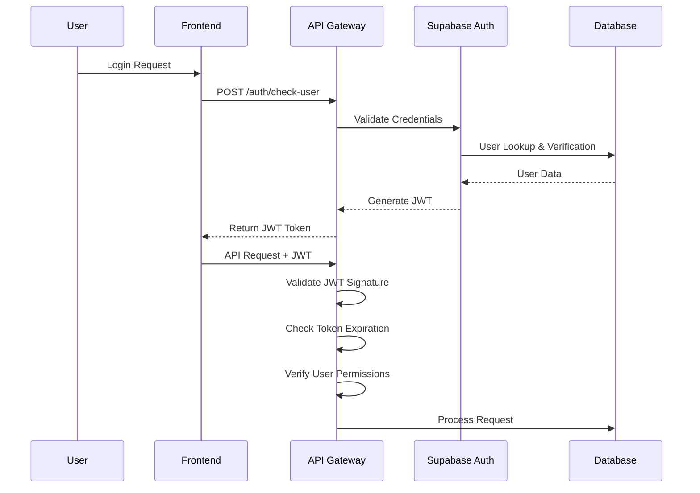
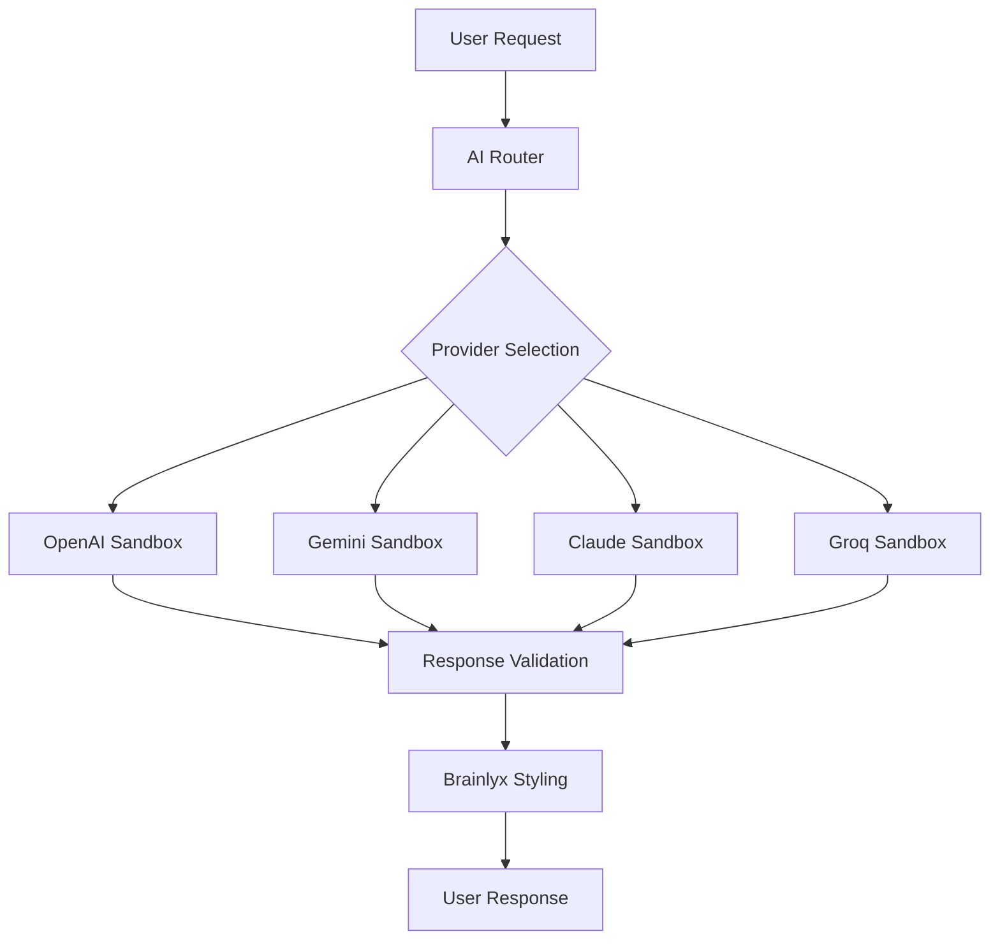

# Security Architecture

## Overview

Brainlyx AI implements a comprehensive security architecture designed to protect user data, prevent unauthorized access, and ensure compliance with industry standards. The platform follows a defense-in-depth strategy with multiple security layers.

## Security Principles

### 1. Privacy by Design
- **Data Minimization**: Only collect essential user information
- **Purpose Limitation**: Data used only for stated purposes
- **Storage Limitation**: Automatic data deletion when no longer needed
- **Security by Default**: Secure configurations enabled by default

### 2. Zero Trust Architecture
- **Never Trust, Always Verify**: Every request is authenticated and authorized
- **Micro-Segmentation**: Network segmentation and access controls
- **Least Privilege**: Minimum permissions required for operations
- **Continuous Monitoring**: Real-time security event monitoring

### 3. Defense in Depth
- **Multiple Security Layers**: No single point of failure
- **Fail-Safe Defaults**: Secure behavior when systems fail
- **Redundancy**: Backup systems and failover mechanisms
- **Regular Updates**: Continuous security patching and updates

## Authentication & Authorization

### JWT-Based Authentication

#### Token Structure
```typescript
interface JwtPayload {
  user_id: string;
  email: string;
  role: 'user' | 'admin';
  exp: number;        // Expiration timestamp
  iat: number;        // Issued at timestamp
  jti: string;        // Unique token identifier
}
```

#### Token Lifecycle


#### Security Measures
- **Short Token Lifespan**: 1-hour expiration for access tokens
- **Secure Signing**: RS256 algorithm with strong key pairs
- **Token Revocation**: Database-backed token blacklist
- **Refresh Tokens**: Separate long-lived tokens for session renewal

### Role-Based Access Control (RBAC)

#### Permission Matrix
```typescript
type UserRole = 'user' | 'admin';

interface Permissions {
  // Chat Operations
  create_session: boolean;
  read_session: boolean;    // Own sessions only
  update_session: boolean;  // Own sessions only
  delete_session: boolean;  // Own sessions only

  // Message Operations
  send_message: boolean;
  read_messages: boolean;   // Own messages only
  delete_message: boolean;  // Own messages only

  // File Operations
  upload_file: boolean;
  analyze_file: boolean;

  // Settings
  manage_api_keys: boolean; // Own keys only

  // Admin Operations (admin role only)
  view_all_users: boolean;
  manage_users: boolean;
  view_analytics: boolean;
  system_configuration: boolean;
}
```

#### Access Control Implementation
```typescript
// Middleware-based authorization
export async function requireAuth(request: NextRequest, requiredRole?: UserRole) {
  const token = extractToken(request);
  const payload = verifyToken(token);

  if (!payload) {
    throw new Error('Invalid token');
  }

  if (requiredRole && payload.role !== requiredRole) {
    throw new Error('Insufficient permissions');
  }

  return payload;
}

// Resource ownership validation
export async function validateOwnership(userId: string, resourceId: string, resourceType: string) {
  const resource = await getResource(resourceId, resourceType);

  if (resource.user_id !== userId) {
    throw new Error('Access denied: resource ownership violation');
  }
}
```

## Data Protection

### API Key Security

#### Encryption at Rest
```typescript
// AES-256-GCM encryption for API keys
const encryptApiKey = (plainKey: string, userId: string): string => {
  const masterKey = getMasterKey(); // From secure key management
  const salt = crypto.randomBytes(32);
  const key = crypto.pbkdf2Sync(masterKey, salt, 100000, 32, 'sha256');

  const cipher = crypto.createCipher('aes-256-gcm', key);
  const encrypted = Buffer.concat([
    cipher.update(plainKey, 'utf8'),
    cipher.final()
  ]);

  const tag = cipher.getAuthTag();
  return Buffer.concat([salt, encrypted, tag]).toString('base64');
};
```

#### Key Management
- **Envelope Encryption**: API keys encrypted with user-specific keys
- **Key Rotation**: Automatic rotation of encryption keys
- **Secure Storage**: Keys stored in dedicated encrypted columns
- **Access Logging**: All key access events logged and monitored

#### Transmission Security
- **TLS 1.3**: End-to-end encrypted connections
- **Certificate Pinning**: Client-side certificate validation
- **HSTS Headers**: Strict transport security enforcement
- **Secure Cookies**: HttpOnly, Secure, SameSite flags

### Data Minimization & Retention

#### Data Collection Policy
```typescript
interface DataRetentionPolicy {
  // User profile data - retained indefinitely
  user_profiles: 'indefinite';

  // Chat sessions and messages - user controlled
  chat_sessions: 'user_deletable';
  chat_history: 'user_deletable';

  // API keys - encrypted, user controlled
  user_api_keys: 'user_deletable';

  // Analytics and logs - limited retention
  api_logs: '90_days';
  audit_logs: '1_year';
  error_logs: '30_days';
}
```

#### Automated Data Deletion
```sql
-- Automatic cleanup of old data
CREATE OR REPLACE FUNCTION cleanup_old_data()
RETURNS void AS $$
BEGIN
  -- Delete old API logs
  DELETE FROM api_logs WHERE created_at < NOW() - INTERVAL '90 days';

  -- Delete old error logs
  DELETE FROM error_logs WHERE created_at < NOW() - INTERVAL '30 days';

  -- Archive old audit logs (move to cold storage)
  INSERT INTO audit_logs_archive
  SELECT * FROM audit_logs WHERE created_at < NOW() - INTERVAL '1 year';

  DELETE FROM audit_logs WHERE created_at < NOW() - INTERVAL '1 year';
END;
$$ LANGUAGE plpgsql;
```

## Network Security

### API Gateway Security

#### Request Validation
```typescript
interface RequestValidationRules {
  // Input sanitization
  sanitize: {
    strings: 'escape_html|trim',
    numbers: 'range_check',
    emails: 'format_validation',
    files: 'type_size_check'
  };

  // Rate limiting
  rateLimit: {
    window: '1_minute',
    maxRequests: 100,
    burstAllowance: 20
  };

  // Content validation
  contentType: ['application/json', 'multipart/form-data'];
  maxBodySize: '10mb';
}
```

#### DDoS Protection
- **Rate Limiting**: Per-IP and per-user request throttling
- **Request Filtering**: Block malicious patterns and payloads
- **Traffic Shaping**: Queue management for burst traffic
- **Auto-scaling**: Dynamic capacity adjustment

### CORS Configuration
```typescript
const corsOptions = {
  origin: process.env.ALLOWED_ORIGINS?.split(',') || ['https://brainlyx.ai'],
  methods: ['GET', 'POST', 'PUT', 'DELETE', 'OPTIONS'],
  allowedHeaders: ['Authorization', 'Content-Type', 'X-Requested-With'],
  credentials: true,
  maxAge: 86400, // 24 hours
  optionsSuccessStatus: 200
};
```

## AI Provider Security

### Multi-Provider Risk Mitigation

#### Provider Isolation


#### Provider Security Measures
- **API Key Isolation**: Each user's keys isolated per provider
- **Request Sandboxing**: Provider calls executed in isolated contexts
- **Response Validation**: AI responses validated before delivery
- **Error Masking**: Provider errors sanitized before user exposure

### Content Security

#### Input Validation
```typescript
interface ContentSecurityRules {
  // Message content validation
  maxLength: 10000;
  allowedPatterns: /^[^<>{}[\]\\]*$/; // No HTML/script injection
  blockedWords: ['malicious', 'harmful', 'illegal'];

  // File upload validation
  allowedTypes: ['image/jpeg', 'image/png', 'application/pdf'];
  maxFileSize: '10MB';
  virusScanning: true;

  // Rate limiting per content type
  textMessages: '60_per_minute';
  fileUploads: '10_per_hour';
}
```

#### Output Sanitization
```typescript
const sanitizeResponse = (aiResponse: string): string => {
  // Remove potentially harmful content
  const sanitized = aiResponse
    .replace(/<script[^>]*>.*?<\/script>/gi, '[CODE BLOCK]')
    .replace(/javascript:/gi, '')
    .replace(/on\w+\s*=/gi, '');

  // Apply Brainlyx professional styling
  return applyBrainlyxStyling(sanitized);
};
```

## Infrastructure Security

### Cloud Security

#### Supabase Security Features
```yaml
Database Security:
  - Row Level Security (RLS): Automatic access control
  - Encrypted Connections: SSL/TLS encryption
  - Audit Logging: All database operations logged
  - Backup Encryption: Automated encrypted backups

Storage Security:
  - Signed URLs: Time-limited access tokens
  - Bucket Policies: Granular access controls
  - File Encryption: Server-side encryption
  - CDN Protection: DDoS and bot protection
```

#### Vercel Platform Security
```yaml
Edge Network Security:
  - DDoS Protection: Cloudflare integration
  - SSL/TLS: Automatic certificate management
  - Firewall: Web application firewall
  - Rate Limiting: Request throttling

Deployment Security:
  - Code Signing: Verified deployments
  - Environment Isolation: Secure environment variables
  - Access Controls: Deployment permission management
  - Rollback Capability: Quick incident response
```

### Container and Runtime Security

#### Serverless Function Security
```typescript
// Function-level security controls
const securityMiddleware = [
  // Request validation
  validateRequest,

  // Authentication
  requireAuth,

  // Authorization
  requirePermission,

  // Input sanitization
  sanitizeInput,

  // Rate limiting
  checkRateLimit,

  // Audit logging
  logAccess
];
```

#### Runtime Protection
- **Memory Limits**: Prevent resource exhaustion attacks
- **Timeout Controls**: Automatic termination of long-running functions
- **Error Handling**: Secure error responses without information leakage
- **Dependency Scanning**: Automated vulnerability detection in packages

## Monitoring & Incident Response

### Security Monitoring

#### Real-time Alerting
```typescript
interface SecurityAlerts {
  // Authentication anomalies
  failed_login_attempts: {
    threshold: 5,
    window: '5_minutes',
    action: 'temporary_lockout'
  };

  // Suspicious activities
  unusual_api_usage: {
    threshold: '2x_normal',
    action: 'review_and_alert'
  };

  // Data access violations
  unauthorized_access: {
    action: 'immediate_alert'
  };

  // System compromises
  privilege_escalation: {
    action: 'emergency_response'
  };
}
```

#### Audit Logging
```typescript
interface AuditEvent {
  timestamp: Date;
  user_id: string;
  action: string;
  resource: string;
  ip_address: string;
  user_agent: string;
  success: boolean;
  details: Record<string, any>;
}

// Comprehensive audit trail
const auditLog = (event: AuditEvent) => {
  // Store in encrypted audit table
  // Send to SIEM system
  // Trigger alerts if necessary
};
```

### Incident Response Plan

#### Response Phases
```yaml
1. Detection:
   - Automated monitoring alerts
   - User-reported incidents
   - Security scanner findings

2. Assessment:
   - Incident classification (severity)
   - Impact analysis (scope and effect)
   - Evidence collection and preservation

3. Containment:
   - Isolate affected systems
   - Block malicious activities
   - Preserve evidence for investigation

4. Recovery:
   - Restore systems from clean backups
   - Verify system integrity
   - Monitor for reoccurrence

5. Lessons Learned:
   - Incident analysis and reporting
   - Security control improvements
   - Process and procedure updates
```

#### Communication Protocol
- **Internal Communication**: Immediate notification to security team
- **User Communication**: Transparent incident disclosure when required
- **Regulatory Reporting**: Compliance with data breach notification laws
- **Stakeholder Updates**: Regular progress reports during incidents

## Compliance & Standards

### GDPR Compliance

#### Data Subject Rights
```typescript
interface DataSubjectRights {
  // Right to access
  access_personal_data: boolean;

  // Right to rectification
  correct_personal_data: boolean;

  // Right to erasure
  delete_personal_data: boolean;

  // Right to restrict processing
  restrict_data_processing: boolean;

  // Right to data portability
  export_personal_data: boolean;

  // Right to object
  object_to_processing: boolean;
}
```

#### Data Processing Records
- **Lawful Basis**: Consent, legitimate interest, contract performance
- **Data Categories**: Personal data, usage data, technical data
- **Retention Periods**: Defined per data type
- **International Transfers**: Adequate protection mechanisms

### Security Standards

#### OWASP Compliance
- **Input Validation**: Prevent injection attacks
- **Authentication**: Secure session management
- **Authorization**: Proper access controls
- **Data Protection**: Encryption and secure storage
- **Logging**: Security event monitoring

#### SOC 2 Readiness
- **Security**: Protect against unauthorized access
- **Availability**: Ensure service reliability
- **Processing Integrity**: Accurate data processing
- **Confidentiality**: Protect sensitive information
- **Privacy**: Handle personal data appropriately

## Security Testing & Validation

### Automated Security Testing

#### Continuous Security Scanning
```yaml
Security Test Suite:
  - SAST: Static application security testing
  - DAST: Dynamic application security testing
  - SCA: Software composition analysis
  - Container scanning: Image vulnerability scanning
  - Dependency checking: Automated package vulnerability detection

CI/CD Security Gates:
  - Code quality checks
  - Security vulnerability scanning
  - License compliance verification
  - Secret detection and removal
```

#### Penetration Testing
- **Regular External Testing**: Quarterly third-party penetration tests
- **Internal Security Assessments**: Monthly automated vulnerability scans
- **Red Team Exercises**: Annual comprehensive security simulations
- **Bug Bounty Program**: Community-driven vulnerability discovery

### Security Metrics & KPIs

#### Key Security Indicators
```typescript
interface SecurityKPIs {
  // Incident response
  mean_time_to_detect: number;    // MTTD
  mean_time_to_respond: number;   // MTTR

  // Vulnerability management
  critical_vulnerabilities: number;
  patch_compliance_rate: number;

  // Access control
  failed_authentication_rate: number;
  privilege_escalation_attempts: number;

  // Data protection
  data_breaches: number;
  encryption_compliance: number;
}
```

#### Security Scorecard
- **Authentication Security**: Multi-factor, password policies
- **Access Management**: RBAC, least privilege implementation
- **Data Protection**: Encryption, data minimization
- **Network Security**: Firewall, intrusion detection
- **Incident Response**: Detection, response, recovery capabilities

This comprehensive security architecture ensures Brainlyx AI maintains the highest standards of data protection, user privacy, and system integrity while providing a secure and trustworthy AI platform.